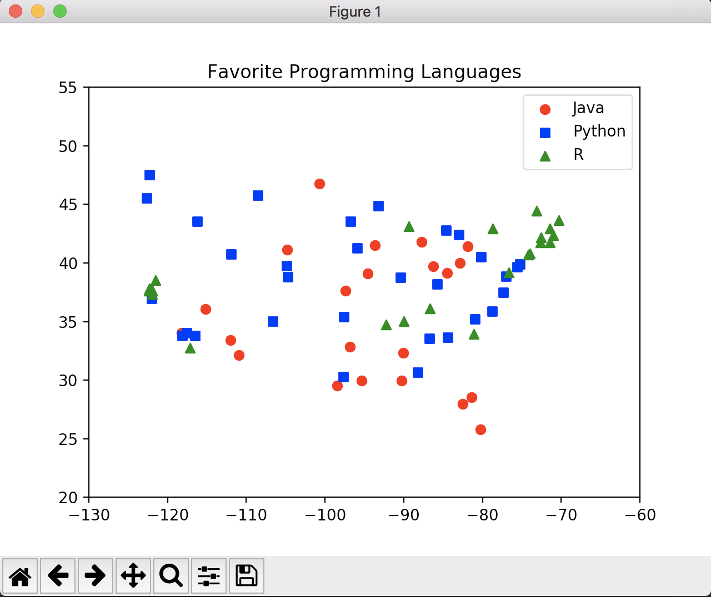
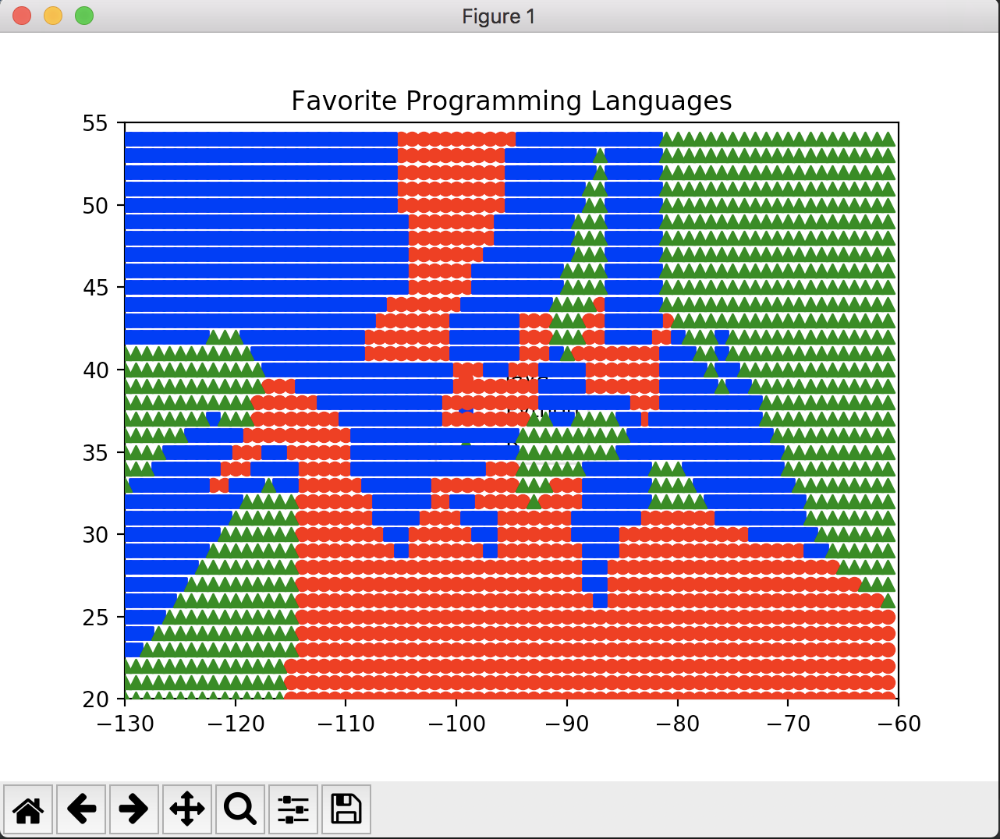
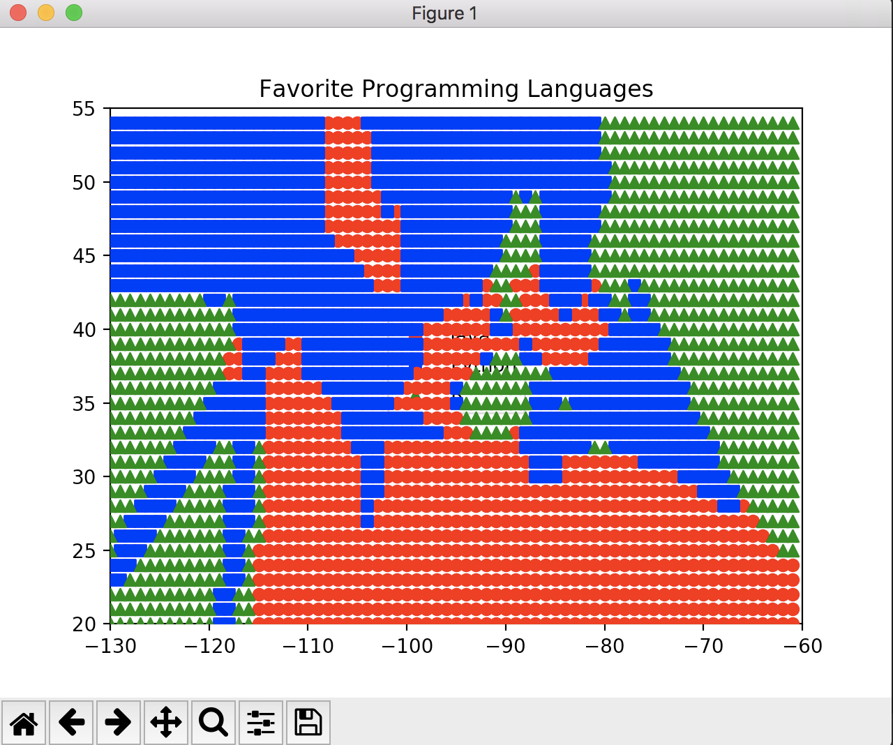
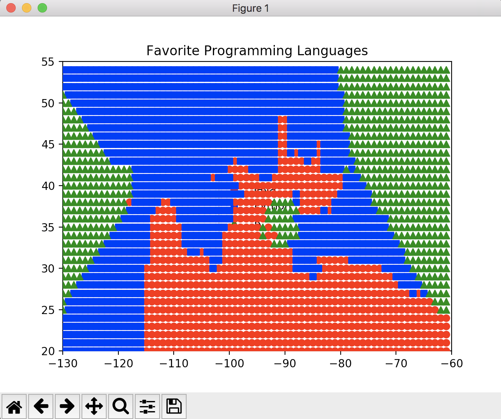

# CMPE-255 Lab 5

### Part 1 Output:
```
1 neighbor[s]: 40 correct out of 75
3 neighbor[s]: 44 correct out of 75
5 neighbor[s]: 41 correct out of 75
7 neighbor[s]: 35 correct out of 75
```

### Part 2 Output:

#### Cities plot
 

#### Classification k = 1 plot:
 

#### Classification k = 3 plot:


#### Classification k = 5 plot:
 

